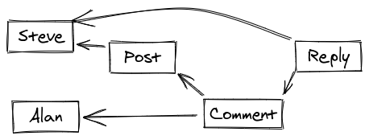

# Balamb 🌱

Concurrently run a set of dependent, asynchronous tasks with type-safe dependencies.

This library was initially intended for data seeding, hence the name, which comes from Final Fantasy VIII. Balamb Garden is a school where cadets, known as SeeDs, are trained.

## To do list

- [x] Concurrency
- [ ] Error handling
- [ ] Better error messaging
- [ ] Tags (run only selected tags)
- [ ] Save/load previously run IDs (can configure to only run new seeds)
- [ ] Idempotency declaration (can be rerun every time, if configured)
- [ ] More docs explaining these features
- [ ] Maybe a CLI?

## Example

```typescript
import Balamb, {BalambError, SeedDef} from "balamb"

const CreateAString: SeedDef<string, void> = {
  id: "a_string",
  description: "Just returns a string",

  plant: async () => "thing",
}

const CreateAnObj: SeedDef<{n: number}, {s: string}> = {
  id: "an_object",
  description: "Just returns an object, based on its dependency",

  dependsOn: {s: CreateAString},

  plant: async ({s}) => ({
    n: s.length,
  }),
}

const seeds = Balamb.register([CreateAString, CreateAnObj])

if (seeds instanceof BalambError) {
  throw new Error("oh no")
}

await seeds.run()
```

## Why is this useful?

To be overly concise (and maybe too abstract):

- manually ordering complex workflows efficiently is hard and gets messy
- wiring together dependencies is boring and time-consuming
- the above distracts from the 'business logic' - the tasks themselves

Let's look at some examples.

```typescript
// Running two tasks sequentially:
const result1 = await task1()
await task2(result1)

// Running two tasks concurrently:
await Promise.all([task1, task2])
```

Those were pretty simple. Now let's think about an example of seeding some data for a social network.

- Steve makes a post
- Alan comments on Steve's post
- Steve replies to Alan's comment

The dependencies look like this:



We might write that like so:

```typescript
const steve = await createSteve()
const stevesPost = await createPostBy(steve)

const alan = await createAlan()
const alansComment = await createComment(alan, stevesPost)

const reply = await createReply(steve, alansComment)
```

That works, but it's not efficient: it runs everything sequentially.

Instead, we might write this:

```typescript
const [{steve, stevesPost}, alan] = await Promise.all([
  createSteve().then((steve) => ({
    steve,
    stevesPost: await createPostBy(steve),
  })),
  createAlan(),
])

const alansComment = await createComment(alan, stevesPost)

const reply = await createReply(steve, alansComment)
```

I had to spend some time thinking about that! I'm not particularly happy with it either.

Hopefully this illustrates the beginnings of what this might end up looking like with even bigger examples, and what this library aims to help avoid.

Instead, we can write it like this, assuming the task definitions (seeds) and their dependencies have been written elsewhere:

```typescript
const seeds = Balamb.register([
  Steve,
  StevesPost,
  Alan,
  AlansCommentToSteve,
  StevesReplyToAlan,
]) as SeededGarden

await seeds.run()
```

Done! This will run in a generally efficient way with no manual wiring.

## Similar libraries

- [promise-dag](https://github.com/vvvvalvalval/promise-dag)
- [dagmise](https://github.com/SidBala/dagmise)
- [Viae.ts](https://github.com/alephnan/viae.ts)
